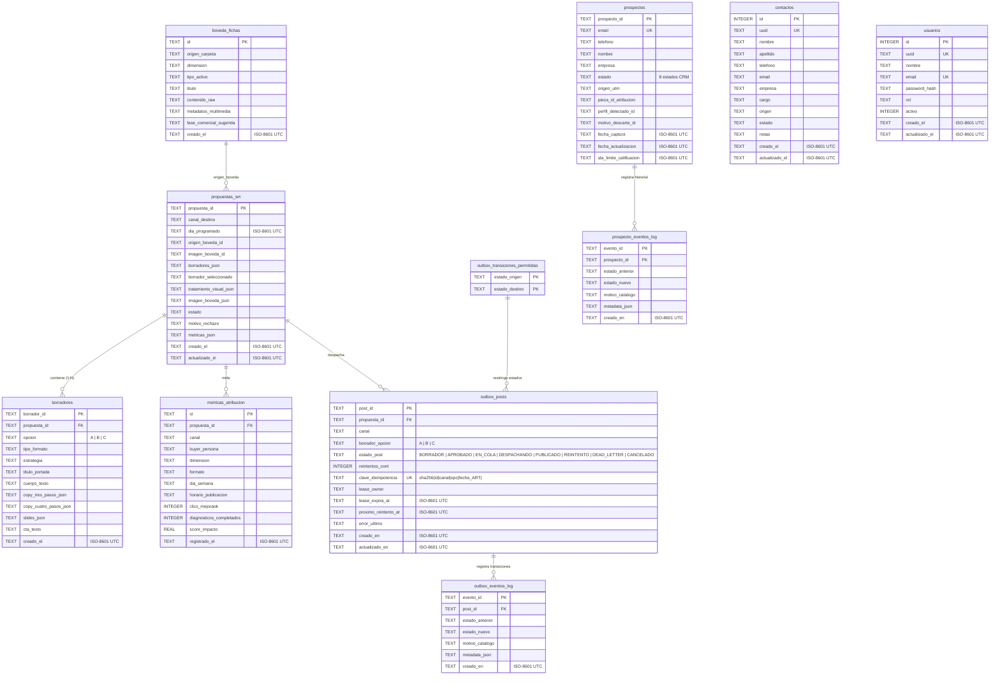

# Diagrama Entidad-Relación (DER) — Parche v1.1.0

```mermaid
erDiagram
    boveda_fichas ||--o{ propuestas_sm : "origen_boveda"
    propuestas_sm ||--o{ borradores : "contiene (1:N)"
    propuestas_sm ||--o{ metricas_atribucion : "mide"
    propuestas_sm ||--o{ outbox_posts : "despacha"
    outbox_posts ||--o{ outbox_eventos_log : "registra transiciones"
    outbox_transiciones_permitidas ||--o{ outbox_posts : "restringe estados"
    prospectos ||--o{ prospecto_eventos_log : "registra historial"

    boveda_fichas {
        TEXT id PK
        TEXT origen_carpeta
        TEXT dimension
        TEXT tipo_activo
        TEXT titulo
        TEXT contenido_raw
        TEXT metadatos_multimedia
        TEXT fase_comercial_sugerida
        TEXT creado_el "ISO-8601 UTC"
    }

    propuestas_sm {
        TEXT propuesta_id PK
        TEXT canal_destino
        TEXT dia_programado "ISO-8601 UTC"
        TEXT origen_boveda_id
        TEXT imagen_boveda_id
        TEXT borradores_json
        TEXT borrador_seleccionado
        TEXT tratamiento_visual_json
        TEXT imagen_boveda_json
        TEXT estado
        TEXT motivo_rechazo
        TEXT metricas_json
        TEXT creado_el "ISO-8601 UTC"
        TEXT actualizado_el "ISO-8601 UTC"
    }

    borradores {
        TEXT borrador_id PK
        TEXT propuesta_id FK
        TEXT opcion "A | B | C"
        TEXT tipo_formato
        TEXT estrategia
        TEXT titulo_portada
        TEXT cuerpo_texto
        TEXT copy_tres_pasos_json
        TEXT copy_cuatro_pasos_json
        TEXT slides_json
        TEXT cta_texto
        TEXT creado_el "ISO-8601 UTC"
    }

    metricas_atribucion {
        TEXT id PK
        TEXT propuesta_id FK
        TEXT canal
        TEXT buyer_persona
        TEXT dimension
        TEXT formato
        TEXT dia_semana
        TEXT horario_publicacion
        INTEGER clics_mejoraok
        INTEGER diagnosticos_completados
        REAL score_impacto
        TEXT registrado_el "ISO-8601 UTC"
    }

    outbox_posts {
        TEXT post_id PK
        TEXT propuesta_id FK
        TEXT canal
        TEXT borrador_opcion "A | B | C"
        TEXT estado_post "BORRADOR | APROBADO | EN_COLA | DESPACHANDO | PUBLICADO | REINTENTO | DEAD_LETTER | CANCELADO"
        INTEGER reintentos_cont
        TEXT clave_idempotencia UK "sha256(id|canal|opc|fecha_ART)"
        TEXT lease_owner
        TEXT lease_expira_at "ISO-8601 UTC"
        TEXT proximo_reintento_at "ISO-8601 UTC"
        TEXT error_ultimo
        TEXT creado_en "ISO-8601 UTC"
        TEXT actualizado_en "ISO-8601 UTC"
    }

    outbox_eventos_log {
        TEXT evento_id PK
        TEXT post_id FK
        TEXT estado_anterior
        TEXT estado_nuevo
        TEXT motivo_catalogo
        TEXT metadata_json
        TEXT creado_en "ISO-8601 UTC"
    }

    outbox_transiciones_permitidas {
        TEXT estado_origen PK
        TEXT estado_destino PK
    }

    prospectos {
        TEXT prospecto_id PK
        TEXT email UK
        TEXT telefono
        TEXT nombre
        TEXT empresa
        TEXT estado "8 estados CRM"
        TEXT origen_utm
        TEXT pieza_id_atribucion
        TEXT perfil_detectado_id
        TEXT motivo_descarte_id
        TEXT fecha_captura "ISO-8601 UTC"
        TEXT fecha_actualizacion "ISO-8601 UTC"
        TEXT sla_limite_calificacion "ISO-8601 UTC"
    }

    prospecto_eventos_log {
        TEXT evento_id PK
        TEXT prospecto_id FK
        TEXT estado_anterior
        TEXT estado_nuevo
        TEXT motivo_catalogo
        TEXT metadata_json
        TEXT creado_en "ISO-8601 UTC"
    }

    contactos {
        INTEGER id PK
        TEXT uuid UK
        TEXT nombre
        TEXT apellido
        TEXT telefono
        TEXT email
        TEXT empresa
        TEXT cargo
        TEXT origen
        TEXT estado
        TEXT notas
        TEXT creado_el "ISO-8601 UTC"
        TEXT actualizado_el "ISO-8601 UTC"
    }

    usuarios {
        INTEGER id PK
        TEXT uuid UK
        TEXT nombre
        TEXT email UK
        TEXT password_hash
        TEXT rol
        INTEGER activo
        TEXT creado_el "ISO-8601 UTC"
        TEXT actualizado_el "ISO-8601 UTC"
    }
```
